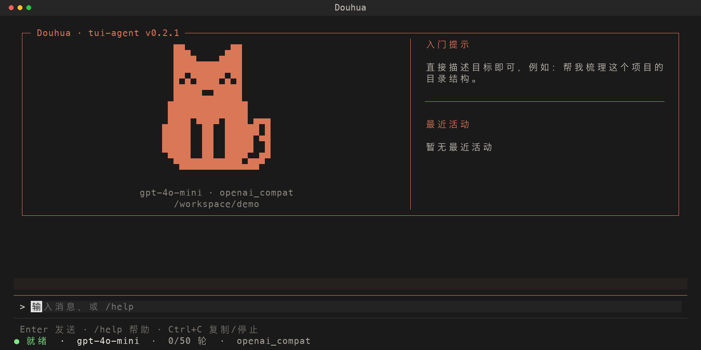
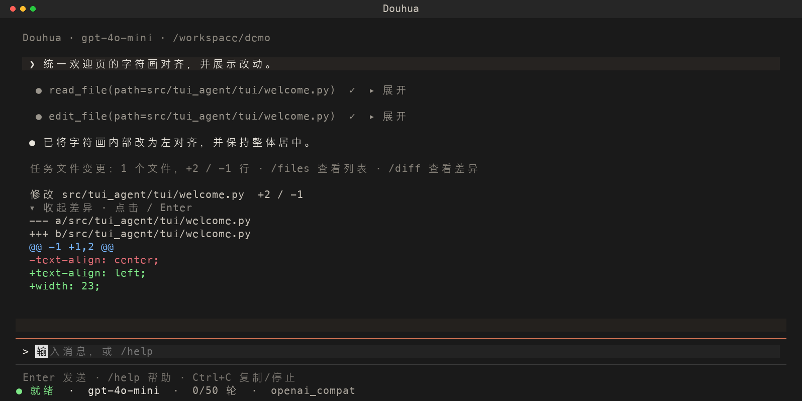

<p align="center">
  
</p>

<h1 align="center">STA · Simple TUI Agent</h1>

<p align="center">在终端中用自然语言阅读代码、修改文件、执行开发任务。</p>

<p align="center">
  <a href="pyproject.toml"></a>
  <a href="#快速开始"></a>
  <a href="LICENSE"></a>
</p>

<p align="center">
  <a href="#快速开始">快速开始</a> ·
  <a href="#配置">配置</a> ·
  <a href="#常用操作">常用操作</a> ·
  <a href="docs/ui-guide.md">完整使用指南</a>
</p>

## 能做什么

- **编码与执行**：浏览目录、读取和搜索代码、精确编辑文件、运行 Shell 命令。
- **变更可见**：写入前预览影响和 diff，完成后查看文件列表与净增删行数。
- **任务可恢复**：保留会话历史与任务检查点，支持中断后续接、文件撤销。
- **轻量交互**：键盘选择菜单、可折叠工具结果、临时问答 `/btw`，支持 OpenAI 兼容与 Anthropic API。



首条任务消息后，猫咪欢迎页自动收为一行，为对话腾出空间。工具详情和长 diff 可按需展开。



## 快速开始

普通使用推荐通过 [uv](https://docs.astral.sh/uv/getting-started/installation/) 安装。需要可用的模型 API Key，建议终端尺寸至少 **80×24**。

安装好 `uv` 后，执行一次（从 GitHub 安装需要 Git）：

```bash
uv tool install --python 3.12 'git+https://github.com/Akito-Go/Simple-Tui-Agent.git'
```

`uv` 自动管理 Python 和独立运行环境，无需手动创建或激活虚拟环境。若提示命令目录不在 `PATH` 中，运行 `uv tool update-shell` 后重新打开终端。

在需要操作的项目目录启动：

```bash
cd 你的项目
sta
```

首次启动且未配置 API Key 时，会引导选择服务商、填写 API 地址、模型和密钥，完成后进入聊天。支持 OpenAI 兼容服务与 Anthropic；第三方服务填写对应的 API 地址和模型名。配置保存在用户目录，换项目无需重复填写。

```bash
sta --setup    # 重新配置，完成后退出
sta --version  # 查看安装版本
```

**启动时的当前目录就是工作区**；会话与检查点仍按项目保存在 `.tui-agent/`。`tui-agent` 和 `python -m tui_agent` 保留兼容。

更新与卸载：

```bash
uv tool upgrade tui-agent
uv tool uninstall tui-agent
```

卸载仅移除程序，保留用户配置和项目历史。源码开发方式见下方“开发”。

## 配置

常规配置优先级：已有环境变量 → 工作区 `.env` → 工作区 `.tui-agent.yaml` → `~/.tui-agent.yaml` → 内置默认值。

| 配置项 | 用途 |
| --- | --- |
| `TUI_AGENT_PROVIDER` | `openai_compat` 或 `anthropic` |
| `TUI_AGENT_API_KEY` / `OPENAI_API_KEY` | OpenAI 兼容服务密钥 |
| `ANTHROPIC_API_KEY` | Anthropic 服务密钥 |
| `TUI_AGENT_MODEL` / `TUI_AGENT_API_BASE` | 当前模型与 API 地址 |
| `TUI_AGENT_MODELS` | `/model` 菜单中的模型列表 |
| `TUI_AGENT_MAX_TURNS` | 每个任务的最大轮次，默认 `50` |

超时、重试和上下文预算等选项见 [.env.example](.env.example)。密钥优先读取环境变量或工作区 `.env`，未设置时按服务商读取 `~/.tui-agent.yaml` 的 `api_keys`。向导将密钥明文保存在该用户配置文件中，macOS / Linux 文件权限为 `0600`；不要将该文件提交到 Git。已有 `.env` 的用户可以继续沿用原配置。

## 常用操作

菜单用 **↑↓ 选择、Enter 确认、Esc 取消**。输入 `/` 查看命令候选，Tab 补全；工具详情可点击，或用 Shift+Tab 聚焦后按 Enter 展开。

| 命令 | 用途 |
| --- | --- |
| `/help`、`/status` | 查看帮助、模型和任务状态 |
| `/model`、`/provider` | 选择模型或服务提供商 |
| `/plan <目标>` | 生成计划，不执行修改 |
| `/btw <问题>` | 临时问答；主任务继续，不调用工具、不写入历史 |
| `/files`、`/diff [路径]` | 查看本任务文件列表、统计与差异 |
| `/sessions` | 选择并恢复历史对话 |
| `/resume` | 选择并继续未完成任务 |
| `/undo`、`/undo list` | 预览最近任务的文件撤销，或选择其他任务 |
| `/undo confirm`、`/undo cancel` | 确认或取消已预览的撤销 |
| `/clear` | 清空当前对话，保留磁盘历史 |
| `/sessions delete [all]` | 删除所选或全部过去会话，执行前确认；当前会话保留，重启后仍可见 |
| `/stop`、`/exit` | 停止主任务、保存并退出 |

**复制与停止**：Ctrl+C 优先复制应用内选区；无选区时先关闭临时面板或停止任务。空闲时先清空输入，输入为空时 2 秒内连按两次退出。macOS 也可使用终端自身的 Cmd+C。Esc 关闭选择菜单、临时问答或停止任务。

**操作确认**：只读工具自动执行；写入和 Shell 先请求确认。`Y` 允许一次，`A` 本会话允许，`N` 拒绝。文件预览显示操作类型与预计增删行数。

## 非交互模式

```bash
sta --prompt "检查项目测试" --json
```

`--prompt` 直接执行任务，`--json` 输出结构化结果。写入和 Shell 默认不会自动批准；需要自动批准时显式添加 `--yes`。

## 数据与边界

- 会话与检查点保存在工作区的 `.tui-agent/`，已被本仓库的 Git 忽略规则排除。
- `/resume` 从保存的上下文重新判断剩余工作，不重放旧工具队列；续接创建新的会话与检查点。
- `/diff`、`/files` 和 `/undo` 只覆盖文件写入／编辑工具的记录，**不包含 Shell 副作用**。后续手动修改会标注，撤销遇到冲突会停止。
- `/session` 是 `/sessions` 的兼容写法。仅启动、操作菜单后退出不会创建空历史；旧版空记录不再展示。
- 删除历史会同时删除所选会话的关联检查点，失去对应恢复与撤销记录；项目文件不变。
- Shell 使用当前用户的系统权限，工作区限制不是系统沙箱。

完整快捷键、限制与故障排查见 [界面使用指南](docs/ui-guide.md) 和 [Runtime 说明](docs/runtime-improvements.md)。

## 0.2.0 更新

- 支持通过 `uv` 独立安装，新增 `sta` 启动入口和 `--version`，保留原有启动方式。
- 新增首次配置向导与 `--setup`，用户级服务配置和密钥可跨项目复用，环境变量与工作区 `.env` 仍优先。
- 保护包含密钥的用户配置文件，并隔离测试的用户目录和模型环境变量。

本次为向后兼容的功能新增，按 SemVer 升级次版本号；会话与检查点格式不变。

## 0.1.1 更新

- 精简欢迎页与工具信息，修复字符画对齐；文档截图改为 PNG，避免中文重叠和颜色丢失。
- 增加键盘选择菜单、选区复制与分状态中断、历史清理和 `/btw` 临时问答。
- 增强搜索筛选、文件影响预览与差异展示；模型过载提示去重，补齐 529 等 5xx 的退避重试。
- 修正 Windows 换行测试，CI 各平台独立跑完；移除旧会话输入分支及无效展示参数。
- 修复测试会话写入真实项目的问题，避免清理历史后运行测试又出现示例会话。

## 开发

开发需要 Python 3.11+。源码修改需要实时生效时，使用可编辑安装：

```bash
git clone https://github.com/Akito-Go/Simple-Tui-Agent.git
cd Simple-Tui-Agent
python3 -m venv .venv
source .venv/bin/activate
python -m pip install -e ".[dev]"
python -m tui_agent
python -m pytest -q
python -m ruff check src tests
```

Windows 使用 `python -m venv .venv`，PowerShell 激活命令为 `.venv\Scripts\Activate.ps1`。开发环境新开终端后需要重新激活。

也可以在源码目录执行 `uv tool install --python 3.12 .` 试用当前代码，无需激活环境；这是普通安装，后续修改源码需重新执行 `uv tool install --force --python 3.12 .`。

测试默认隔离工作区、用户目录和模型环境变量，会话日志、检查点及配置不会写入真实用户目录。

项目使用 Python、Textual、OpenAI／Anthropic SDK，自行实现 Agent 循环、工具与会话管理。模块说明见 [架构文档](docs/architecture.md)。

版本遵循 [SemVer 2.0.0](https://semver.org/lang/zh-CN/)，以 [pyproject.toml](pyproject.toml) 为准；当前处于 `0.x` 开发阶段，README 徽章不代表已发布版本。许可证：[MIT](LICENSE)。
