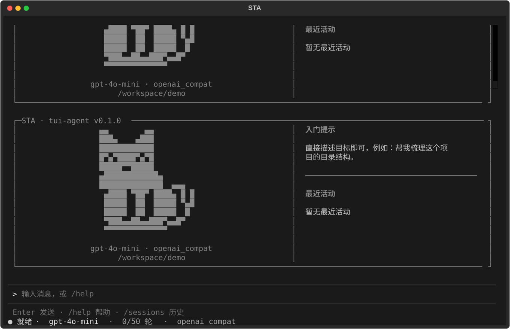
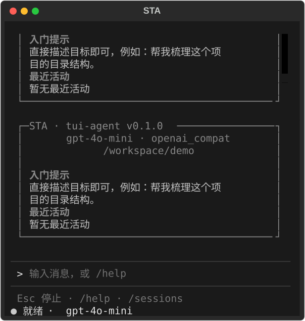
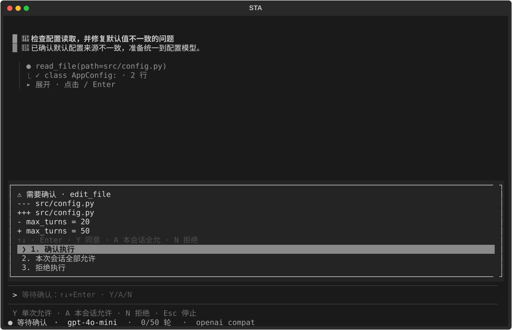

# STA 界面使用说明

## 启动

在项目目录激活虚拟环境后执行：

```bash
source .venv/bin/activate
python -m tui_agent
```

Windows 激活方式和首次 API 配置见 [README](../README.md)。如果安装时使用了 `pip install -e .`，更新源码后重启即可看到界面变化。

## STA 坐猫

STA（Simple TUI Agent）使用原版 12 行橙色终端半块字符坐猫：尖耳、弯弯笑眼、并拢前爪和卷尾。图案直接由字符组成，不依赖终端的图片协议；下图是同一字符图案的像素预览。


## 界面布局

欢迎页直接展示坐猫、模型与工作区，不再显示“欢迎回来”标题。

对话区占据主要空间，底部固定输入与状态。橙色表示活动或焦点，黄色表示待确认，红色表示失败；状态同时包含文字，避免只靠颜色区分。

宽窗口欢迎页显示品牌、模型、工作区、入门提示与最近活动。



终端宽度不足 84 列时改为上下布局，隐藏大字标。底栏根据窗口宽度省略次要信息，始终优先保留状态和模型。推荐至少 80×24；布局测试覆盖 120×40、80×24 和 48×20，更小尺寸不保证所有选项同时可见。



## 工具结果

成功结果默认显示工具名、参数和首行摘要。点击结果，或 Tab 聚焦后按 Enter / 空格，展开、收起本次返回内容。失败结果默认展开并标红，可在内容区滚动查看诊断信息。

展开不会重新执行工具。若返回内容包含 `.tui-agent/results/` 路径，说明更长的结果保存在文件中；请让 Agent 使用 `read_file` 的行范围或 `char_offset` 游标继续读取。

## 确认与停止

写入、编辑或 Shell 操作需要确认时，输入框上方显示操作预览，输入框暂时禁用。预览可滚动；短窗口压缩预览高度以保留操作选项。

| 操作 | 按键 |
|------|------|
| 允许当前操作 | Y 或 1 |
| 本次会话后续写入 / Shell 免确认 | A 或 2 |
| 拒绝当前操作 | N 或 3 |
| 移动选项并提交 | ↑↓ + Enter |
| 停止整个任务 | Esc 或 /stop |

`A` 的设置在 `/clear` 后重置；命令黑名单仍然生效。等待确认时直接按 Esc 可结束任务。



## 状态与常用命令

底栏提示随就绪、运行、确认状态变化。状态栏按「状态 → 模型 → 任务轮次 → Provider」的优先级显示；窄窗口下可用 `/status` 查看详细信息。

- `/help`：查看命令。
- `/sessions`：选择恢复历史会话。
- `/clear`：开始新会话，保留旧会话文件。
- `/model`、`/provider`：切换模型或提供商，先停止正在运行的任务。
- `/exit` 或 Ctrl+C：退出。

## 验证与范围

示例图片由 Textual 测试界面导出，使用虚构工作区与内容，没有调用真实模型。布局测试验证输入框和确认选项可见、工具详情键盘展开及失败状态；终端字体、emoji 和颜色可能随终端而异。

助手回复目前按纯文本显示，尚未加入 Markdown 代码高亮、多行编辑器或命令补全。
