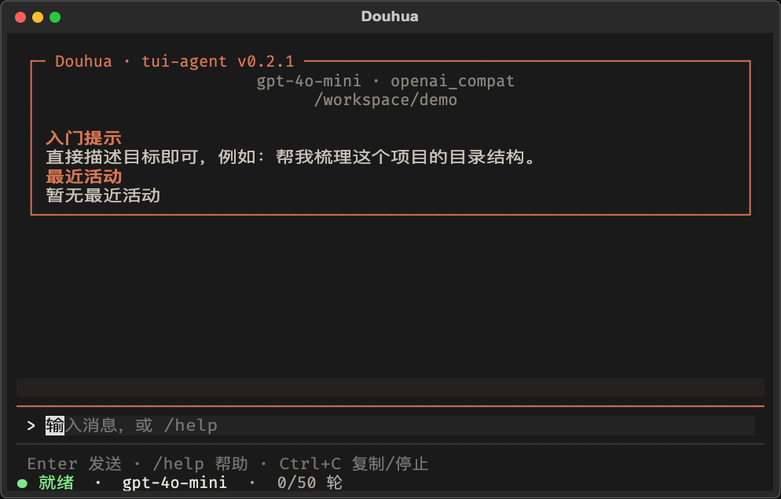
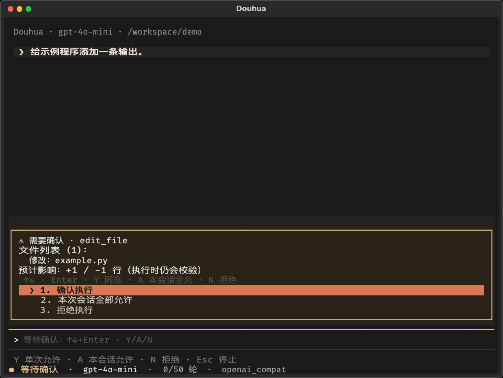

# Douhua 界面使用说明

## 启动

通过 `uv tool install` 安装后，在目标项目目录直接执行：

```bash
douhua
```

无需激活虚拟环境。首次缺少 API Key 时自动进入配置向导，配置保存在 `~/.tui-agent.yaml`，换项目可以复用。`douhua --setup` 可重新配置，`douhua --version` 查看版本。工作区 `.env` 和环境变量优先于用户配置。

安装、更新和卸载命令见 [README](../README.md)。若使用 `pip install -e .` 开发，仍需激活对应虚拟环境；更新源码后重启即可看到变化。

## Douhua 坐猫

Douhua（Simple TUI Agent）使用原版 12 行橙色终端半块字符坐猫：尖耳、弯弯笑眼、并拢前爪和卷尾。图案直接由字符组成，不依赖终端的图片协议；下图由当前字符画生成，使用透明底矢量图；PNG 版本同步保留。


## 界面布局

欢迎页直接展示坐猫、模型与工作区，不再显示“欢迎回来”标题。

对话区占据主要空间，底部固定输入与状态。橙色表示活动或焦点，黄色表示待确认，红色表示失败；状态同时包含文字，避免只靠颜色区分。

宽窗口欢迎页显示品牌、模型、工作区、入门提示与最近活动。


终端宽度不足 84 列时改为上下布局，隐藏大字标。底栏根据窗口宽度省略次要信息，始终优先保留状态和模型。推荐至少 80×24；布局测试覆盖 120×40、80×24 和 48×20，更小尺寸不保证所有选项同时可见。



## 任务阶段

开始任务后，聊天区会显示目标；状态栏会跟踪分析、执行工具、等待确认和完成阶段，并显示工具进度。写入或编辑涉及的路径会记录为本任务的修改文件。

## 工具结果

成功结果默认显示工具名、目标和状态。点击结果，或从输入框用 Shift+Tab 向前聚焦后按 Enter / 空格，展开、收起本次返回内容。失败结果默认展开并标红，可在内容区滚动查看诊断信息。

展开不会重新执行工具。若返回内容包含 `.tui-agent/results/` 路径，说明更长的结果保存在文件中；请让 Agent 使用 `read_file` 的行范围或 `char_offset` 游标继续读取。

## 确认与停止

写入、编辑或 Shell 操作需要确认时，输入框上方显示操作预览，输入框暂时禁用。预览可滚动；短窗口压缩预览高度以保留操作选项。

| 操作 | 按键 |
|------|------|
| 允许当前操作 | Y 或 1 |
| 本次会话后续写入 / Shell 免确认 | A 或 2 |
| 拒绝当前操作 | N 或 3 |
| 移动选项并提交 | ↑↓ + Enter |
| 停止整个任务 | Esc 或 /stop |

`A` 的设置在 `/clear` 后重置；命令黑名单仍然生效。等待确认时直接按 Esc 可结束任务。



## 状态与常用命令

底栏提示随就绪、运行、确认状态变化。状态栏按「状态 → 模型 → 任务轮次 → Provider」的优先级显示；窄窗口下可用 `/status` 查看详细信息。

- `/help`：查看命令。
- `/sessions`：选择恢复历史会话。
- `/clear`：开始新会话，保留旧会话文件。
- `/model`、`/provider`：切换模型或提供商，先停止正在运行的任务。
- `/exit`：退出；空闲且输入为空时，2 秒内连按两次 Ctrl+C 退出。

## 验证与范围

界面示例由 Textual 渲染数据按字符格生成 PNG，固定中文字体与颜色，使用虚构工作区与内容，没有调用真实模型。布局测试验证输入框和确认选项可见、工具详情键盘展开及失败状态；终端字体、emoji 和颜色可能随终端而异。

助手回复目前按纯文本显示，尚未加入 Markdown 代码高亮或多行编辑器；已支持 Tab 命令补全与菜单选择。

输入框按 `Tab` 会根据当前词补全内置命令、工具名和可用模型。

## 非交互模式

```bash
python -m tui_agent --prompt "运行测试并汇总结果" --json
```

`--prompt` 执行后退出，`--json` 输出 `success`、`message`、`phase` 和 `changed_files`。写入、编辑和 Shell 操作默认不会自动批准；脚本明确承担该责任时使用 `--yes`。


## 任务检查点、恢复与撤销

任务开始、模型轮次和工具执行边界会保存检查点，包括原始目标、阶段、对话上下文和执行结果。`write_file` / `edit_file` 在真正写入前保存原内容与预期结果，写后记录实际结果，全部位于工作区 `.tui-agent/checkpoints/`，不进入 Git。

### 恢复未完成任务

1. 使用 `/stop` 或 Esc 停止任务；退出或进程中断留下的任务也会保留检查点。
2. 重启 Douhua，在相同工作区输入 `/resume`，查看最近 10 个未完成任务。
3. 用 ↑↓ 选择任务并按 Enter，或输入 `/resume <完整检查点ID>`。Douhua 核对该任务记录的文件，将变化说明和历史交给当前模型，再判断剩余工作。

恢复不会重放旧工具队列；未完成的调用先补充中断说明。原本的会话免确认授权与文件已读缓存不继承，新的写入和 Shell 调用重新走权限确认。核对只覆盖检查点记录的文件，不代表验证过整个仓库或 Shell 的外部副作用。

续接会创建独立会话和检查点，原始日志仍可用 `/sessions` 查看。续接使用当前模型及配置，并获得新一轮任务轮次额度；原检查点标记为已续接，之后从新的未完成检查点继续。续接段只记录本段的文件修改，避免撤销时覆盖中断期间用户手工编辑的内容。

### 撤销文件修改

```text
/undo list
/undo <完整检查点ID>
/undo confirm
```

`/undo` 不带参数时预览最近有文件记录的检查点。预览明确列出将恢复原内容、权限的文件，以及将删除的新建文件。输入 `/undo confirm` 才执行；`/undo cancel` 或 Esc 取消预览，开始新任务也会使旧预览失效。

确认时重新检查全部文件：任何文件与记录的修改后内容或权限不一致，整批操作在写入前停止。已被删除、换成符号链接或被其他任务修改的文件也会导致冲突。执行结束后清除已读缓存，并在当前会话记录撤销说明，后续任务应重新读取文件。

如果撤销多文件时发生磁盘错误，可能已有部分文件恢复；检查点保留“撤销中”状态。修复磁盘问题后重新预览并确认，可跳过已恢复的文件，继续剩余部分。跨文件不提供事务性原子恢复，也不能与其他进程同时修改这些文件。

### 范围与限制

- 支持 UTF-8 文本文件，恢复内容（含原始换行）和权限位；新建文件会删除，新建目录保留。
- 单文件最多 2 MB，每个检查点最多 100 个文件、约 20 MB 序列化文件快照；超限会阻止对应文件工具写入。
- 只覆盖 Douhua 内置文件写入/编辑工具；Shell 造成的文件修改、安装依赖、数据库或网络操作均不能自动撤销。
- 完成或已撤销的任务不再通过 `/resume` 继续；可以发起新任务。恢复前的旧版本会话没有检查点时仍使用 `/sessions`。
- 检查点是本地单进程使用的恢复材料，不会创建 Git commit，不提供多进程同时恢复或撤销同一检查点的保证。

### 文件影响预览与任务变更

文件工具请求权限时，会列出目标文件及新增／修改／覆盖类型、预计增删行数和 diff 预览。长预览截断显示，可在确认框中滚动；执行前仍会校验已读状态及文件冲突。Shell 确认显示命令和工作目录，无法预测的文件影响明确标为未追踪。

- `/files`：列出当前任务的文件净变更及增删行数。
- `/diff`：查看当前任务全部文件差异。
- `/diff <工作区相对路径>`：查看指定文件，路径含空格时直接输入，无需引号。

统计比较 checkpoint 中任务起点与最后记录结果，同一文件多次编辑只计算净变化，不包含任务前已有的 Git 工作区修改。任务结束后自动显示文件列表与统计；新建空文件也计为一个变更文件。后续手动修改或删除仅标注，不混入任务 diff。写入未完成时会核对当前文件，并标记待核实状态。

`/resume` 续接任务以恢复时为新基准；`/clear` 或撤销当前任务后解除检查点关联。没有当前检查点时，命令会提示，不自动选取其他任务。Shell 修改不在统计范围。diff 单文件最多显示 12000 字符，文件列表报告最多 48000 字符，超限明确提示截断；统计仍基于完整快照。

### 对话阅读与差异展开

发送首条任务消息后，猫咪欢迎面板自动收为一行品牌、模型和工作目录。用户消息使用浅底色与 `❯` 标记，助手正文使用 `●` 标记，工具成功结果默认以一行目标、状态和展开入口展示；失败结果直接展开。工具详情支持点击、Enter 或空格切换。

`/diff` 按文件展示差异，新增行绿色、删除行红色，区块位置蓝色；超过 16 行的文件差异默认折叠，点击或聚焦后按 Enter／空格展开。权限确认中的文件差异也使用相同配色，确认操作保持原来的键盘方式。

### 键盘选择与退出

- `/model`、`/provider`、`/sessions`、`/resume` 和 `/undo list` 打开可滚动选择菜单：↑↓ 移动，Enter 确认，Esc 取消，也可点击选项。取消后回到输入框。
- 原有 `/model <序号或名称>`、`/provider <名称>`、`/sessions <序号>`、`/resume <完整 ID>` 仍可使用。
- Ctrl+C 优先复制应用内选区；没有选区时先关闭菜单或临时问答、取消撤销预览、停止运行任务；空闲时先清空输入，输入为空时 2 秒内连按两次退出。`/exit` 直接走保存与退出流程。Esc 关闭临时面板或停止任务，不退出程序。
- 空输入按 Tab 不填入无关命令；输入 `/` 后显示命令候选。可用 Shift+Tab 从输入框向前聚焦工具详情或 diff，按 Enter 展开。

### 复制文本

输入框选区或对话区拖选文字后，Ctrl+C 复制该选区，不停止任务。复制通过终端剪贴板协议完成，是否能写入系统剪贴板取决于终端支持；macOS 通常也可用终端自身的 Cmd+C，Linux／Windows 的许多终端使用 Ctrl+Shift+C。终端自身的选择与快捷键由终端处理，应用无法判断它的选区。

### 删除过去会话

`/sessions delete` 打开过去会话列表，选中后再确认永久删除；`/sessions delete all` 预览并确认清理全部非当前会话。确认默认选中“取消”。运行中或等待工具权限时不能清理。`all` 指全部过去会话，当前会话仍保留，重启后会显示为历史；这不代表已删除记录被恢复。兼容 `/session` 单数写法。只打开程序后退出不创建空历史，旧版仅含元数据的空记录不再展示。

删除范围是所选会话的 JSONL 日志及 `session_id` 对应的检查点，包含检查点里的上下文和文件快照；相应的 `/resume`、`/undo` 能力也会失去。当前会话、项目文件、运行日志和工具输出文件不删除。预览后文件变化会拒绝执行并要求重新预览；多文件删除不是事务，磁盘故障可能部分完成，界面会报告失败。

### 临时问答 /btw

输入 `/btw <问题>` 可以在主任务运行期间顺便提问。临时面板使用发起时的模型和有界上下文摘录，最多参考最近 12 条有文字的消息；上下文可能不完整，也不会看到提问后的主任务进展。

问答使用独立连接，不调用工具、不修改主会话、检查点或轮次，也不保存到历史。长回答最多展示 16000 字符。Esc 关闭面板并取消未完成问答；主任务继续运行，要停止主任务可用 `/stop` 或关闭面板后再按 Esc。一次只开一个临时问答，工具权限等待期间请先处理确认。需要真正执行操作时，请关闭临时问答后向主对话发送任务。
